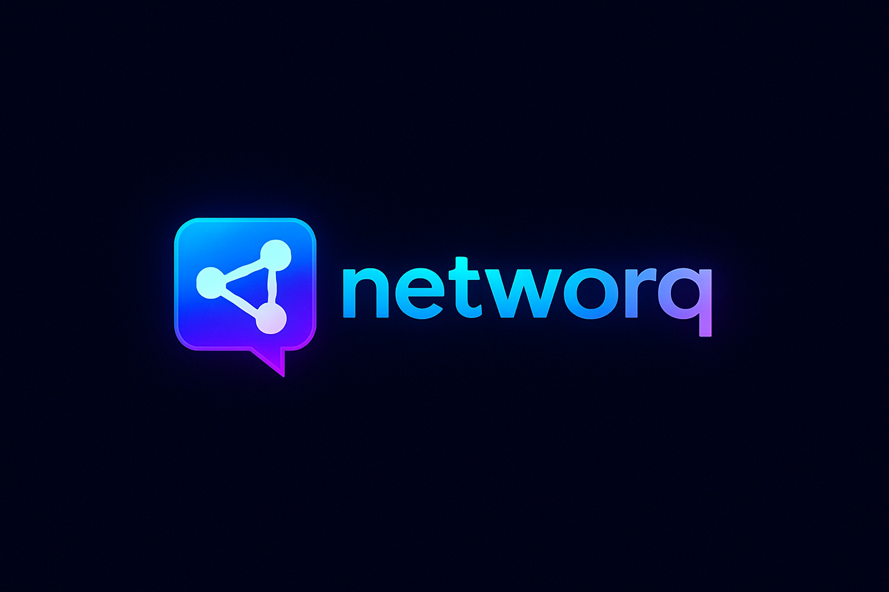

# 🚀 Project Highlights



---
## 🔗 Live Website

[networq](https://networq-rho.vercel.app)

## 🧱 Tech Stack
- **Next.js App Router**
- **PostgreSQL** (Postgres)
- **Prisma**
- **Clerk**
- **TypeScript**

---

## 💻 Core Features

- Server Components, Layouts, Route Handlers, Server Actions
- `loading.tsx`, `not-found.tsx` support
- API Integration using Route Handlers
- Data Fetching, Caching & Revalidation
- Client & Server Components
- Dynamic & Static Routes

---

## 🎨 UI & Styling

- Tailwind CSS
- Shadcn UI Components

---

## 🔒 Auth & File Handling

- Authentication & Authorization with Clerk
- File Uploads using UploadThing

---

## 🗃️ Database Integration

- Integrated with Prisma ORM
- Server Actions & Form Handling
- Optimistic UI Updates

---

## ⚙️ Setup Instructions

### 1. Create `.env` File

```env
NEXT_PUBLIC_CLERK_PUBLISHABLE_KEY=
CLERK_SECRET_KEY=
DATABASE_URL=
UPLOADTHING_TOKEN=
```

### 2. Run the App

```bash
npm run dev
```
